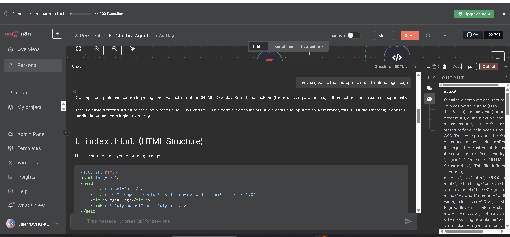
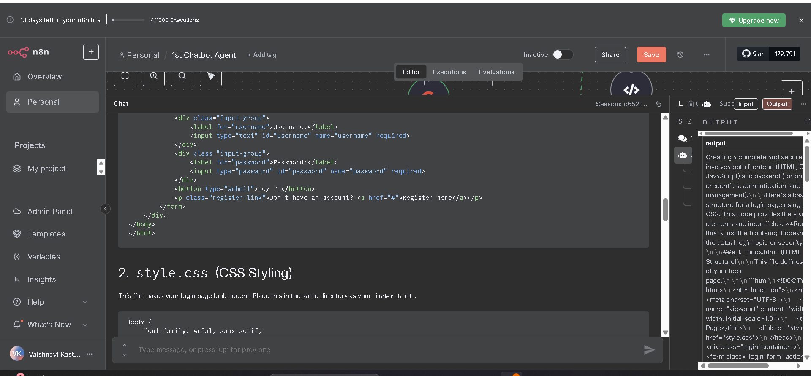
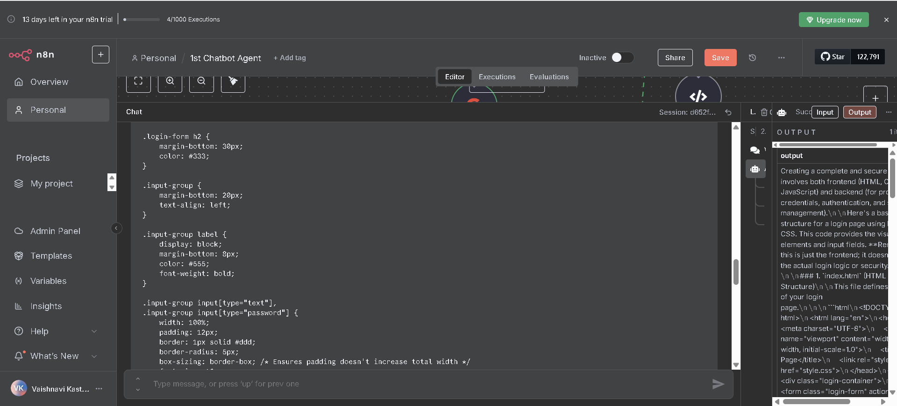
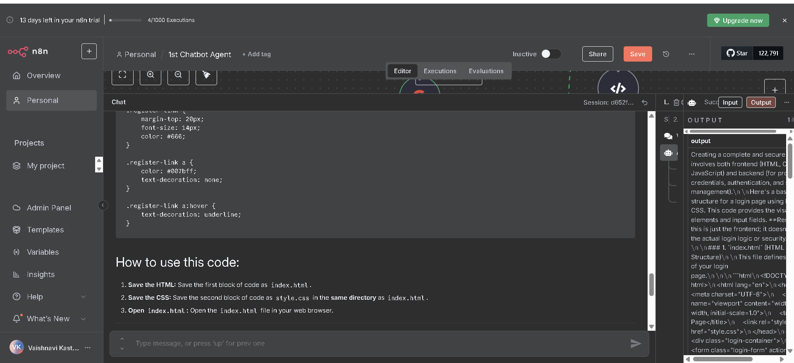

# 🤖 n8n CodeGen Bot

This is a no-code AI chatbot built using [n8n](https://n8n.io/) that can generate and review code using Google Gemini and Code Tools.

---

## ⚙️ Components

- 🧠 **AI Agent**: Central logic node using Google Gemini
- 📩 **Trigger**: Chat message receiver
- 🧠 **Memory**: Simple Memory for conversational context
- 🛠 **Tool**: Code Tool for generation, review, or explanation

---

## 🛠 How to Use

1. Import the JSON workflow in n8n.
2. Configure the Google Gemini API key in the credentials.
3. Activate the workflow.
4. Open the chat and start coding with natural prompts.

---

## 📦 Exported Workflow

This repo includes:

- `1st Chatbot.json`: the workflow file to import into n8n.

## 🧭 Workflow Diagram

This is the visual layout of the AI chatbot built using n8n:

# n8n CodeGen Chatbot 🤖

This is a chatbot built using **n8n**, powered by **Gemini**, with code generation and review capabilities.

---

## 💬 Sample Q&A

### Question 
> 
>
> 
>
> 
>
> 
